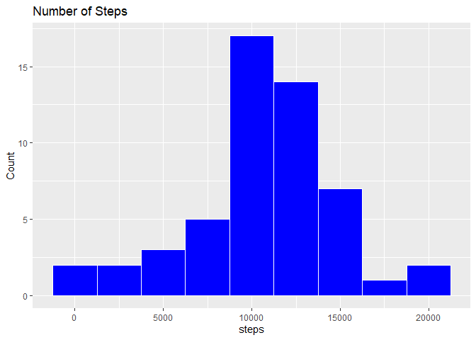
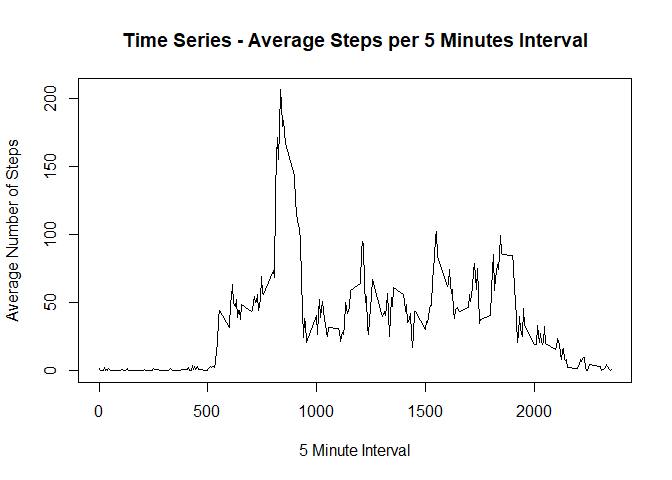
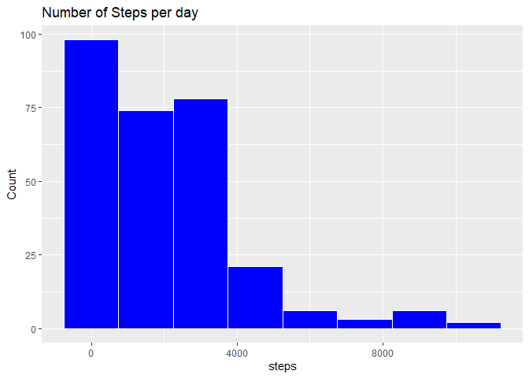
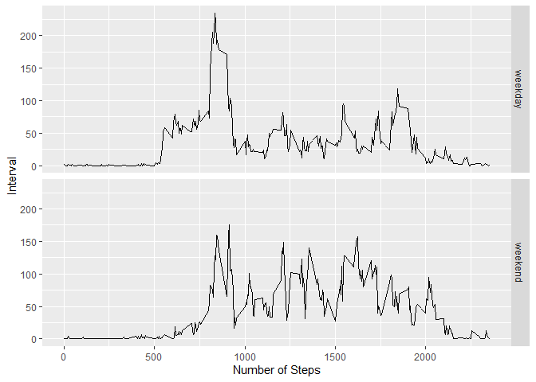

## Loading and preprocessing the data

```r
#Loading Data
raw_data <- read.csv("activity.csv",header = TRUE)

#Converts all the character values from the date column to a date format
raw_data$date <- as.Date(raw_data$date, "%Y-%m-%d")

#removes all NA values from the dataset

processed_data <- na.omit(raw_data)
```

## What is mean total number of steps taken per day?

```r
# This Code calculates the total number of steps per day

Total_Steps_by_Date <- aggregate(steps ~ date, data = processed_data, FUN = sum)


# This Code shows a histogram of the steps, it is worth noticing that the size is set to 500 in order to show a condensed readable data
library(ggplot2)
```

```
## Warning: package 'ggplot2' was built under R version 3.6.3
```

```r
Histogram_Steps_day <- ggplot(Total_Steps_by_Date,aes(steps)) + geom_histogram( col = "white", fill = "blue", binwidth = 2500) + labs(title = "Number of Steps", x = "steps", y="Count")
print(Histogram_Steps_day)
```

<!-- -->

```r
# This Code calculates the average number  of steps per day
Mean_Steps_by_Date <- mean(Total_Steps_by_Date$steps)
print(Mean_Steps_by_Date)
```

```
## [1] 10766.19
```

```r
# This Code Calculates the median number of steps per day

Median_Steps_by_Date <- median(Total_Steps_by_Date$steps)
print(Median_Steps_by_Date)
```

```
## [1] 10765
```

## What is the average daily activity pattern?


```r
# The first step is to simply create a time series (using the plot base system), of each intervale (i.e 0,5,10 up to 2355) and the average steps for each interval for each date

Average_steps_interval <- aggregate(steps ~ interval, data = processed_data, FUN = mean)

# 1.- Make a time series plot (i.e. type = "l") of the 5-minute interval (x-axis) and the average number of steps taken, averaged across all days (y-axis)

plot(Average_steps_interval$interval,Average_steps_interval$steps, xlab = "5 Minute Interval", ylab =  "Average Number of Steps", type ="l" , main = "Time Series - Average Steps per 5 Minutes Interval")
```

<!-- -->

```r
# 2.- Which 5-minute interval, on average across all the days in the dataset, contains the maximum number of steps?
i <- which.max(Average_steps_interval$steps)
Maximum_5minute_interval<- Average_steps_interval[i,1]
print(Maximum_5minute_interval)
```

```
## [1] 835
```

## Imputing missing values

```r
Number_of_NA <- sapply(raw_data, function(x) sum(is.na(x)))

NA_in_Steps <- Number_of_NA[1]

# The number of NA's in the dataset is equal to:
print(NA_in_Steps)
```

steps 
 2304 

```r
#copying the raw_data to a new variable just in case
Missing_Values_data <- raw_data
vector <- which(is.na(Missing_Values_data$steps))

# Firstly we identify the NA values and we match this missing values
# to the average value per interval (5 minutes)

 for(i in vector){
   
   m <- Missing_Values_data[i,3]
   
   t <- filter(Average_steps_interval, Average_steps_interval$interval == m)
   v <- t[1,2]
   Missing_Values_data$steps[i] = v
    
   
     }

#Make a histogram of the total number of steps taken each day and Calculate and report the mean and median total number of steps taken per day.
Total_Steps_MV <- aggregate(steps ~ interval, data = Missing_Values_data, FUN = sum)
  
  


#Histogram
library(ggplot2)
Histogram_Steps <- ggplot(Total_Steps_MV,aes(steps)) + geom_histogram( col = "white", fill = "blue", binwidth = 1500) + labs(title = "Number of Steps per day", x = "steps", y="Count")
print(Histogram_Steps)
```

<!-- -->

```r
#Do these values differ from the estimates from the first part of the assignment? 
# The values differ significantly, as now we have more data so the mean has been redcued


#What is the impact of imputing missing data on the estimates of the total daily number of steps?
#Additional data increases the frequency(count) per interval
```


```r
# Mean Value

mean(Total_Steps_MV$steps)
```

```
## [1] 1981.278
```

```r
#Median 

median(Total_Steps_MV$steps)
```

```
## [1] 1808
```

## Are there differences in activity patterns between weekdays and weekends?

```r
library(dplyr)
```

```
## Warning: package 'dplyr' was built under R version 3.6.3
```

```
## 
## Attaching package: 'dplyr'
```

```
## The following objects are masked from 'package:stats':
## 
##     filter, lag
```

```
## The following objects are masked from 'package:base':
## 
##     intersect, setdiff, setequal, union
```

```r
Data_by_Weekday <- Missing_Values_data


Data_by_Weekday <- mutate(Data_by_Weekday, weekday = weekdays(date))

#Chaging the values from weekday to weekend
 Data_by_Weekday$weekday <-  ifelse(Data_by_Weekday$weekday %in% c("Sunday","Saturday"),"weekend","weekday")

 # Average number of steps per interval (every 5 minutes), per weekend
 
Weekend_data <- aggregate(steps ~ interval,data = filter(Data_by_Weekday, weekday == "weekend"), FUN = mean)

Weekend_data$weektype <- "weekend"


 # Average number of steps per interval (every 5 minutes), per weekday 

Weekday_data <- aggregate(steps ~ interval,data = filter(Data_by_Weekday, weekday == "weekday"), FUN = mean)
Weekday_data$weektype <- "weekday"


Act_pattern_Plot <- rbind(Weekend_data,Weekday_data)

#Make a histogram of the total number of steps taken each day and Calculate and report the mean and median total number of steps taken per day.
#Do these values differ from the estimates from the first part of the assignment? 
#What is the impact of imputing missing data on the estimates of the total daily number of steps?

qplot(interval,steps,data = Act_pattern_Plot, facets = weektype~.,geom = "line", xlab = "Number of Steps", ylab ="Interval") 
```

<!-- -->

```r
# There is clearly a difference between Weekends and Weekdays, there is more activity during the week
```


